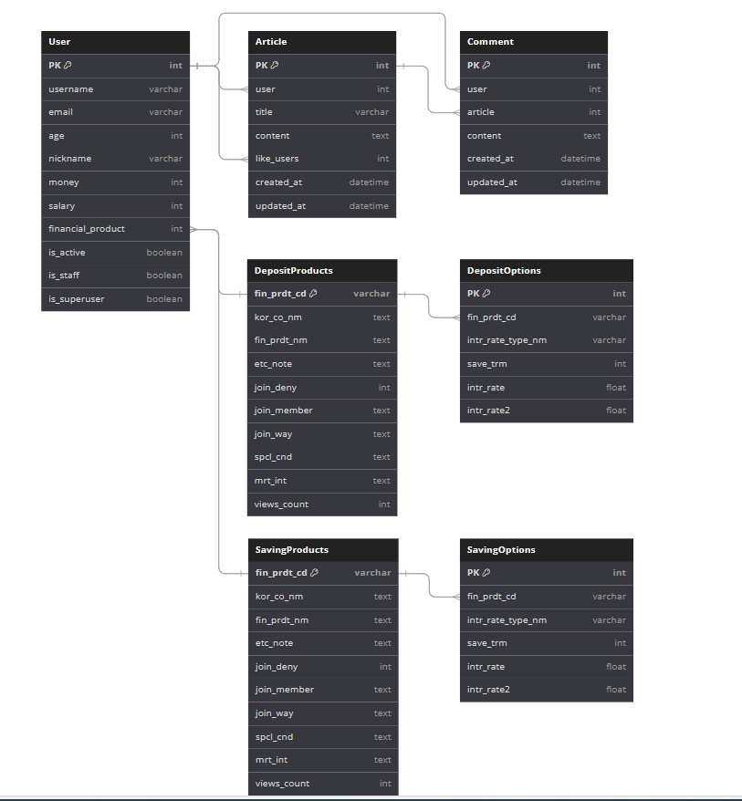

# 10_pjt

### 메인 디자인

공란

### 프로젝트 개요

- 설명: asd
- 기간 :ㅁㄴㅇ

### 팀원

| 이름   | 담당 영역                                 | &nbsp;&nbsp; Github                      |
| ------ | ----------------------------------------- | --------------------------- |
| 황우성 | 백엔드(Django), 프론트엔드(Vue) | https://github.com/WOOSEONG-1   |
| 전기철 | 백엔드(Django), 프론트엔드(Vue)           | https://github.com/jbs3047 |

### ✏ 기술 스택

### Backend

### Frontend

 

### DevOps

### Other Tools

### 주요 기능
pass

### 서비스
pass

### 개발 계획
pass

### 명세서
pass

### ERD

### 개발 일정
pass

### 기능 완성도
pass

### 소감

### 황우성
pass

### 전기철
pass
