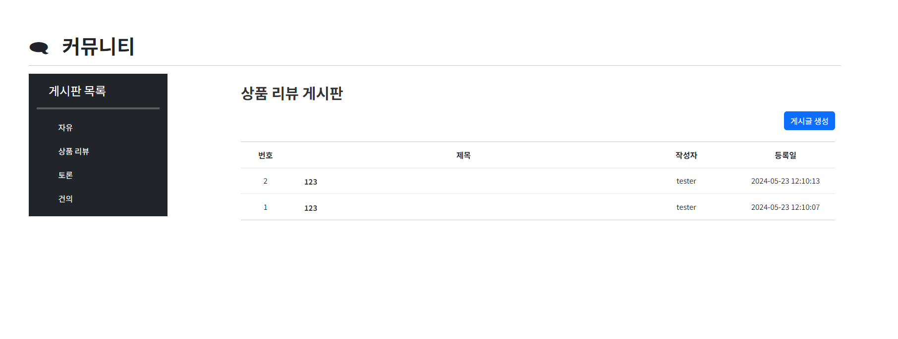

# 돈나무 서비스

### ✅ 메인 디자인

### ✅ 프로젝트 개요

- 설명: 예금 적금 상품 조회 서비스 및 AI를 이용한 추천 서비스
- 기간 : 2024-05-16(목) ~ 2024-05-24(금)

### 👨‍👦 팀원

| 이름   | 담당 영역                                 |                     |
| ------ | ----------------------------------------- | --------------------------- |
| 황우성 | 백엔드(Django), 프론트엔드(Vue),  서버 인프라 구성 | https://github.com/WOOSEONG-1   |
| 전기철 | 백엔드(Django), 프론트엔드(Vue) | https://github.com/jbs3047 |

## 🏁 [돈나무 서비스 페이지](HTTPS://MYPJT.XYZ/)

### ✏ 기술 스택

### Backend
 

### Frontend
 

### Other Tools
 

### ✅ 설계 내용 및 구현 정도

| No. | 구분                    | 기능                                              | 구현 정도(⭐⭐⭐⭐⭐) |
| --- | ----------------------- | ------------------------------------------------- | --------------------- |
| 1   | 메인 페이지             | 홈페이지 메인 화면 작성                                     | ⭐⭐⭐⭐⭐              |
| 2   | 유저 모델 커스터마이징       | 회원 가입, 로그인, 로그아웃, 정보 수정               | ⭐⭐⭐⭐⭐            |
| 3   | 로그인 기능 구현       | JWT 인증 방식 구현                | ⭐⭐⭐⭐            |
| 4   | 예적금 금리 비교        | 예적금 은행,기간 별 데이터 전체 조회  및 상세 조회     | ⭐⭐⭐⭐⭐              |
| 5   | 환율 계산기             | 환율 데이터 조회 및 환율 계산기 구현              | ⭐⭐⭐⭐⭐              |
| 6   | 은행 검색              | 카카오맵 API 이용 주변 은행 위치 검색             | ⭐⭐⭐⭐⭐              |
| 7   | 커뮤니티(게시판)        | 자유,리뷰 등 게시판 생성 및 CRUD 기능              | ⭐⭐⭐⭐⭐            |
| 8   | 프로필                  | 회원 정보 및 가입한 예금 적금 상품 금리 비교 차트 제공  | ⭐⭐⭐⭐⭐              |
| 9   | 금융 상품 추천 알고리즘 | AI, 빅데이터 기반 상품 추천 알고리즘 구현               | ⭐⭐⭐⭐⭐    

### ✅ ERD

### ✅ 금융 상품 추천 알고리즘 기술

| No. | 구분                    | 기능                                             |
| --- | ----------------------- | -------------------------------------------------| 
| 1   | AI 상품 추천            | - ChatGPT OpenAPI 이용   - 미리 저장한 DB의 예금 적금 정보를 이용하여 사용자의 나이,성별,재산,연봉을 고려한 최적의 예금, 적금 상품 추천 기능                                     |
| 2   | 빅데이터 상품 추천       | - 코사인 유사도 기법 이용   - DB에 저장된 유저들이 가입한 상품을 나이, 성별, 재산, 연봉을 인자로 하여 사용자와 유사할수록 높은 점수를 매겨 추천하는 방식입니다.               | 

### ✅ 주요 기능
#### ✔ 예금/적금 조회 페이지

  
- 은행, 기간 옵션을 입력하여 원하는 정보 확인 가능
- 금리 정렬을 통해 어느 상품이 금리가 높은 지 확인 가능

#### ✔ 환율 계산 페이지

  
- 입력 정보에 따른 실시간 환율 정보 제공
- 현재 환율과 전일 대비 환율 변화량 제공

#### ✔ 주변 은행 검색 페이지

  
- 지역, 은행 선택시 해당 지역 은행 정보 제공
- 지점 선택시 상세 정보 제공

#### ✔ 커뮤니티 페이지

  
- 다양한 게시판을 통한 회원간 커뮤니케이션 기능 제공
- 댓글, 좋아요 기능을 통해 작성된 글에 대한 표현 가능
#### ✔ 추천 알고리즘 페이지

#### 1. AI 기반 상품 추천 서비스

  
- 사용자 데이터에 기반한 AI 상품 추천 서비스
- AI 분석 기반 사용자에게 최적의 금융 상품 추천 서비스를 제공
-   

#### 2. 빅데이터 기반 상품 추천 서비스

  
- 가입한 사용자들의 성별, 나이, 보유금액, 연봉을 데이터로 사용하여 공통점을 가지는 사용자들의 가입 상품을 코사인 유사도 기법을 사용하여 추천 상품을 제공

#### ✔ 프로필 페이지

  
- 프로필 수정 버튼을 통해 설정한 프로필 변경 가능
- 차트를 통해 현재 유저가 가입한 예금과 적금의 금리 비교 및 분석 가능

### ✅ 개발 일정

|          | 황우성                                                                                                                                                      | 전기철                                                                                                                     |
| -------- | ----------------------------------------------------------------------------------------------------------------------------------------------------------- | -------------------------------------------------------------------------------------------------------------------------- |
| 24-05-16 | - 프로젝트 설계 및 아이디어 회의   - 전체 기본 설계 및 DB 모델링  - 게시판 기능 CRUD 구현    | - 프로젝트 설계 및 아이디어 회의   - 전체 기본 설계 및 DB 모델링   - 유저 로그인 기능 구현 시작 |
| 24-05-17 | - 페이지 디자인 컨셉 및 설계   - 목업 & 와이어프레임 작성    | - 유저 로그인 기능 구현   - 유저 회원가입 폼 커스터마이징 구현    - 예적금 금리 데이터 DB 저장   - 예적금 전체 조회, 상세 조회 구현                                                                                    
| 24-05-18 | - 서버 가상 환경 준비 및 설정   - 메인 페이지 제작 | - 환율계산기 구현 시작   |
| 24-05-19 | - 주변 은행 검색 기능 구현   - 주변 은행 검색 페이지 제작    - 게시판 페이지 제작(1/2) | - 환율계산기 구현 완료     |
| 24-05-20 | - 게시판 페이지 제작 (2/2)    - 로그인/회원가입 페이지 제작 | - account serializer 수정    - 로컬 스토리지 설정 완료   - 사용자 인증 방식 -> JWT 토큰 인증 방식으로 변경  |
| 24-05-21 | - 환율 계산기 페이지 제작 및 국가별 동적 이미지 출력 구현    - 서버 Nginx 설정 및 테스트    - 프로필 조회 및 수정 페이지 작성 | - 예적금 가입,탈퇴 기능 구현    - profile 페이지에 가입한 상품 금리 분석 차트 제작  |
| 24-05-22 | - 예금/적금 조회 기능 구현 및 페이지 제작     | - 금융 상품 추천 AI 알고리즘 기능 구현    |
| 24-05-23 | - 상품 추천 페이지 제작 및 빅데이터 기반 추천 기능 구현     - 서버 배포 및 DB Postgresql로 교체    - 최종 테스트 및 에러 검출/수정   - 발표 자료 준비| - access 토큰 만료시 자동 로그아웃 기능 추가     - 최종 테스트 진행    - 발표 자료 준비 |
| 24-05-24 | - 최종 발표    | - 최종 발표    |

### 소감

### 황우성
처음 프로젝트를 시작하던 시기에는 자신만만하게 세웠던 계획들이 시간이 흐르면 흐를수록 해야할 짐이 되고, 정신차리면 하루가 끝나있던 것 같습니다. 그래도 짧은 일정 속에서 처음 계획했던 목표 및 기능들을 모두 달성하고 무사히 프로젝트를 끝마쳤다는 점에서 우리 팀이 정말 대견하다고 느껴졌습니다.  
프론트엔드같은 경우 배운 기간이 짧은 터라 진행하는 내내 어떤 식으로 접근해야 사용자에게 더 나은 이용 경험을 제공할 수 있을까? 를 고민하는 동시에 이 기능은 어떻게 구현해야하지? 와 같은 기술적 숙련도 문제도 동반되었던 것 같습니다. 하지만 프로젝트 기간이 흐르면 흐를수록 작업 속도가 빨라지고 기능 구현에 대한 완성도가 비례하여 올라가는 것을 보면 확실히 성장하였다고 느껴집니다.  
백엔드 쪽에서는 기능 구현에 집중하기보단 최적화에 집중하였습니다. 어떤 방식으로 접근해야 DB 혹은 서버에 부하가 덜 올 수 있을지, 혹은 설계 상에서 불필요한 진행도중 부분이 존재했다면 어떤 식으로 고쳐야 서로 충돌이 없을 지에 관해서 주로 고민했습니다. DB가 다량의 데이터를 조회 및 처리한다는 것을 인지하여 소규모 데이터 처리에 적합한 SQLITE를 대신하여 POSTGRESQL DB로 교체하여 SQLITE에서는 2초 정도 걸리던 빅데이터 분석 시간을 0.5초 가량으로 줄이는 것에 성공하였습니다.  
어려웠던 점은 서버를 구현하는데 정말 많은 에러를 만났습니다. Nginx 설정부터 백엔드-프론트 간 데이터 교환 과정에서 에러 발생, 혹은 로컬에서는 정상적으로 작동하던 기능이 서버에서는 정상적으로 작동하지 않을 때 등 다양한 문제를 겪었습니다. 이러한 문제를 해결하는 과정을 통해 고민했던 시간만큼 경험치 삼아 성장할 수 있는 발판이 되었습니다.

### 전기철
이론과 실전이 확실히 다르다는 것을 알게되었던 기간이였다. 실습을 하면서 이정도는 넘어가도 되겠지 하고 가볍게 진행했던 것들에서 계속 문제가 생겨 진행 자체가 안되는 상황이 많이 있었다. 
시간이 적은 상황이라 오류가 발생하면 할 수록 조급해졌지만 처음부터 천천히 고치다보면 금방 해결될 것이라고 생각하고 차근차근 고치기 시작하다 보니 계획했던 기능들의 대부분을 구현할 수 있었다.  
팀장의 제안으로 JWT 인증 방식을 구현하면서 오류를 해결하는 능력을 기를 수 있었고, 새로운 기능을 구현하면서 흥미가 더 붙어 열심히 할 수 있었던 것 같다. 
도전과제 느낌으로 진행했던 소셜 로그인을 완성하지 못한 점은 아쉽지만 완성도있게 프로젝트를 끝냈다는 것에 기분이 좋았고, 많이 힘들었을텐데 불평없이 잘 이끌어준 팀장에게 감사하다는 말을 전하고 싶다.
